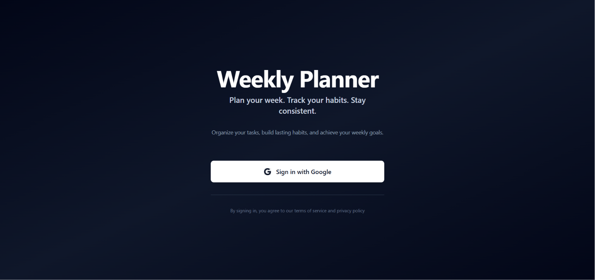
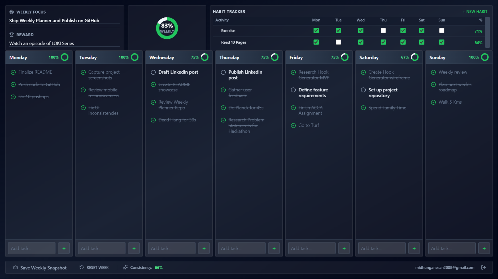
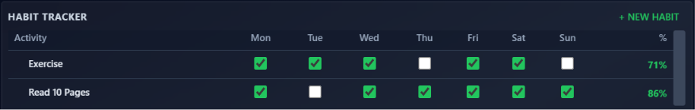
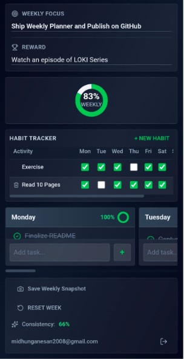

# Weekly Planner

A productivity planner designed to help users organize their week, track habits, stay focused on goals, and build consistency over time.

Built with React, Firebase, and Vercel using AI-assisted development workflows with Cursor and ChatGPT.

---

## Try the App

Use the application instantly without any local setup:

🔗 https://weekly-planner-pink.vercel.app

---

## Why I Built This

I wanted a simple place to plan my week, track habits, and stay accountable to my goals.

Instead of switching between multiple apps for tasks, habits, and weekly planning, I decided to build a single productivity dashboard that combines everything in one place.

This project became my first completed software project and helped me learn practical software development skills including React, Firebase, Git, GitHub, and deployment with Vercel.

---

## Features

- Weekly task planning for all 7 days
- Habit tracking with completion percentages
- Weekly focus and reward system
- Consistency tracking
- Weekly progress visualization
- Google Authentication
- Cloud data storage with Firebase
- Responsive design for desktop and mobile devices
- Weekly snapshot saving

---

## Screenshots

### Login Page



### Main Dashboard



### Habit Tracker



### Mobile View



---

## Tech Stack

### Frontend

- React
- JavaScript
- CSS

### Backend & Database

- Firebase Authentication
- Firebase Firestore

### Deployment

- Vercel

### Development Tools

- VS Code
- Git
- GitHub
- Cursor
- ChatGPT

---

## What I Learned

Building this project taught me:

- React fundamentals and component-based architecture
- Firebase Authentication and Firestore integration
- Git and GitHub workflows
- Deploying applications with Vercel
- Responsive UI design
- Using AI-assisted development workflows effectively

Most importantly, it taught me the value of shipping projects instead of endlessly planning them.

---

## Installation

Clone the repository:

```bash
git clone https://github.com/midhunganesan/weekly-planner.git
```

Navigate to the project folder:

```bash
cd weekly-planner
```

Install dependencies:

```bash
npm install
```

Start the development server:

```bash
npm start
```

---

## AI-Assisted Development

This project was developed using AI-assisted workflows with:

- Cursor
- ChatGPT

AI was used as a development assistant for:

- Brainstorming
- UI improvements
- Debugging
- Code explanations
- Development guidance

All final implementation decisions, testing, deployment, and project ownership remain my responsibility.

---

## Contact

For feedback, suggestions, or collaboration:

📧 [midhunganesan2008@gmail.com](mailto:midhunganesan2008@gmail.com)

---

## License

This project is licensed under the MIT License.
